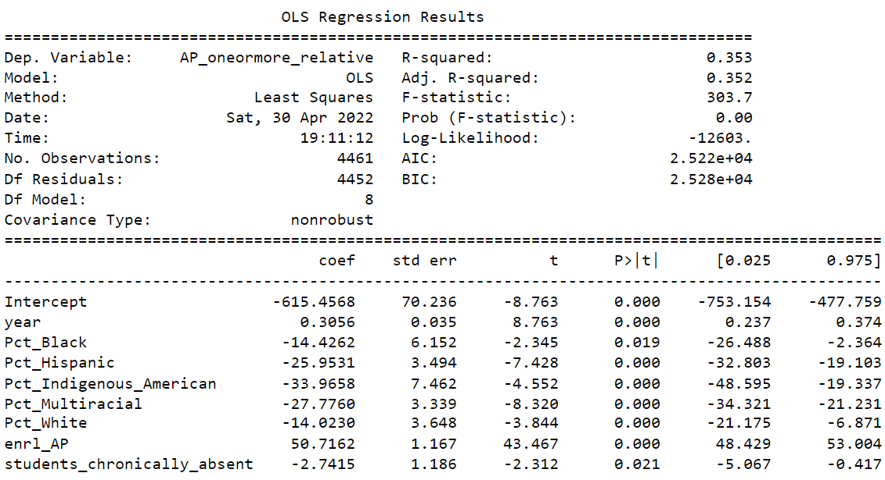

## Feature Selection 

### Backwards Stepwise Linear Regression  

say why!

## Our Chosen Model's Results 

add in other columns again??? 

Take out year???

Our best model: 

    %taking_AP_Exam = Year + %Black + %Hispanic + %Indigenous_American + %Multiracial + %White + 
                      %in_AP_course + %chronically_absent 

We can see that there is a 
