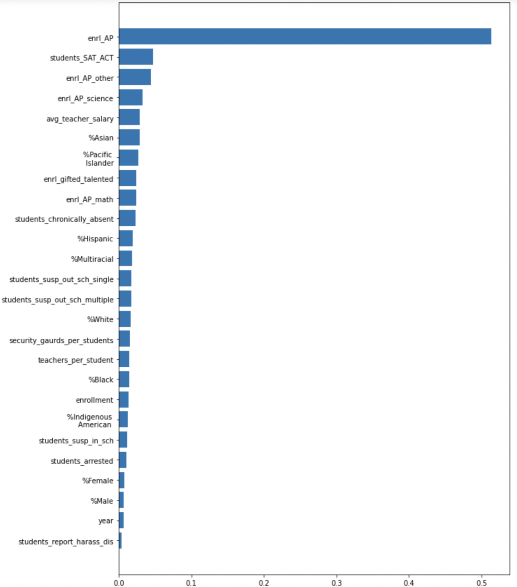

# Random Forest Modeling 

We saw in the previous section that our linear regression model failed to perform very well. Thus, we decided to explore the usage of a Random Forest Regression in order to try to determine which variables in our model explain AP Exam Enrollment the most. This was done because Random Forest Modeling can be used to account for non-linear relationships between our predictors and response. 

We first ran our random forest with the default parameters, but we found that our model was overfitting quite a bit giving us a testing R² of 0.7 and a training value of around 0.3. So, in order to reduce overfitting we used 10 fold cross-validation with a grid search to determine the optimal parameters that should be used in our random forest regression. We used the negative mean squared error in order to determine the accuracy of our models. Our results from this cross validation grid search were the following: 

